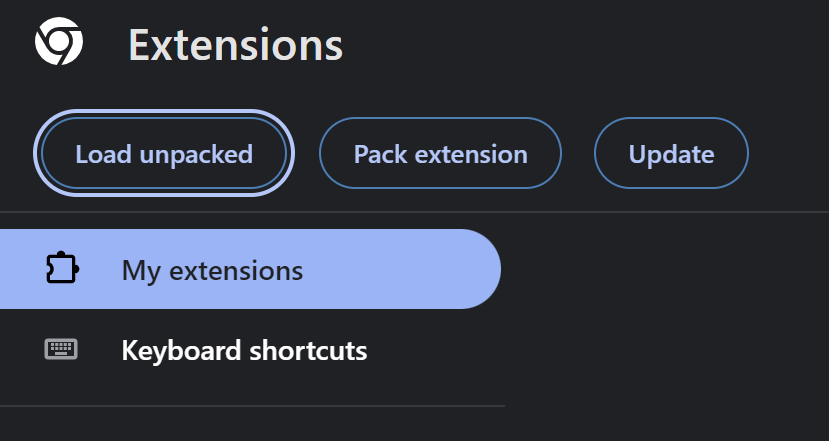

# D&D Character Sync

A Chrome extension to store D&D Character data from different resources.

[D&D Character Sync](https://chrome.google.com/webstore/detail/dd-character-sync/jgcbbmbchbkdjbgiiheminkkkecjohpg)

## Local development

Install dependencies

```sh
npm i
```

Build and watch files

```sh
npm run gulp
```

Load extension into Chrome:


Select the `build/base` directory to load the extension.

### Packaging

Build extension

```sh
npm run gulp build
```

### Note on local extension development

The only way to load the extension in Shieldmaiden.app is to run the local dev env of shieldmaiden and update the ENV file with the id of the local Sync ext.

## Accessing storage data from your website

The local storage of the extension can be accessed from your website using `chrome.runtime.sendMessage()`.

### Getting access

For this to work the extension needs to grant access from your domain. If you are interested in accessing the extensions storage on your website you can create a pull request with an update to `manifest.json` with your domain added to the externally_connectable.matches list.

```json
"externally_connectable": {
  "matches": [
    ...
    "*://your-domain.com/*"
  ]
},
```

### Accessing storage data

With [chrome.runtime.sendMessage()](https://developer.chrome.com/docs/extensions/reference/runtime/#method-sendMessage) storage data can be retrieved from the extension.

```typescript
chrome.runtime.sendMessage(
  extensionId: "jgcbbmbchbkdjbgiiheminkkkecjohpg",
  message: {
    request_content: string[]
  },
  callback: function
)
```

With `message.request_content` you can request the content you'd like to be in the response, right now the options are "characters" and "version".

Below is an example for retrieving all characters using this method.

```javascript
async function getCharacterSyncCharacters() {
	return new Promise((resolve, reject) => {
		chrome.runtime.sendMessage(
			"jgcbbmbchbkdjbgiiheminkkkecjohpg", // The ID of the extension
			{ request_content: ["characters"] }, // The requested content "characters" | "version"
			(response) => {
				// Handle the response
				if (response && response.characters) {
					resolve(response.characters);
				} else {
					reject("No characters found or the extension is not installed.");
				}
			}
		);
	});
}
```

With a simple request you can check if a user has the extension installed.

```javascript
async function extensionInstalled() {
	return new Promise((resolve) => {
		chrome.runtime.sendMessage(
			"jgcbbmbchbkdjbgiiheminkkkecjohpg", // The ID of the extension
			{ request_content: ["version"] }, // The requested content "characters" | "version"
			(response) => {
				// Handle the response
				if (response) {
					resolve(true);
				} else {
					return false;
				}
			}
		);
	});
}
```
